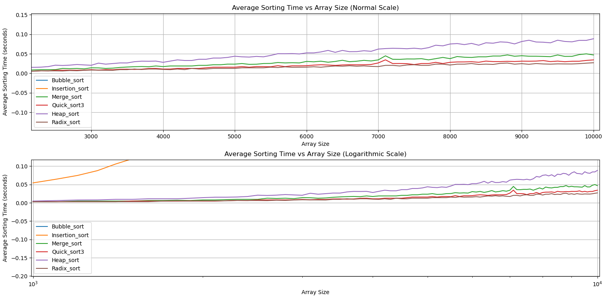
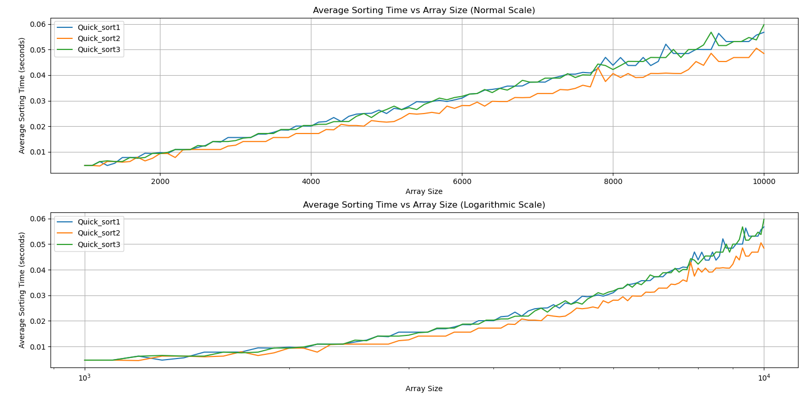

# DAA Sorting Algorithms

This repository contains all source code related to the Analysis of the different Sorting Algorithms:

- Bubble Sort
- Insertion Sort
- Merge Sort
- Heap Sort
- Radix Sort
- Quick Sort, using:

  - First element as pivot
  - Random element as pivot
  - Median of first, middle and last elements as pivot

## **Instructions**

## Download Repository

1. Click on the green **<> Code** button
2. To download the entire repository, you can click on *Download ZIP*
3. Alternatively, open a terminal window in the desired directory
4. Then, to clone the repository, execute: `git clone https://github.com/Vishy70/DAA-Sorting-Algorithms.git`

## Part I: Direct Comparison of Sorting Algorithms

There are two python scripts: [single_sort_test](single_sort_test.py), [all_sort_test](all_sort_test.py)

[single_sort_test](single_sort_test.py):

- Provides option to test running time of a single sorting algorithm manually
- Can choose between sorting you own array, a random array, increasing array, or decreasing array
- You can also choose one sorting algorithm, of you choice
- NOTE: Choose array sizes greater than 500, otherwise time will be too small => 0.0!

[single_sort_test](single_sort_test.py):

- Provides option to test running time of all sorting algorithms, for a single array
- Can choose between sorting you own array, a random array, increasing array, or decreasing array
- Times of the sorting algorithms will be given as output
- NOTE: Choose array sizes greater than 500, otherwise time will be too small => 0.0!

## Generator

The [generator](./generator/) folder has a [generating](./generator/generating.py) file, which contains 4 functions:

- Generate random array
- Generate increasing array
- Generate decreasing array
- Generate array with too many duplicate values

The rest of [generator](./generator/) folder consists of files specific to each sorting algorithm, to create arrays catering to specific best, average and worst case kinds of arrays, as shown below:

## Utilities

[Algorithms](./Algorithms.py) and [plotter](./plotter.py) are modules, which contain functions for the code of all sorts and plotting the graphs respectively.

## Analysis

Please note that running time on sizes greater than 1000 will blow up, due to O($n^2$) bubble nd insertion sort. To achieve reproducability in short time, comment out all bubble/insertion sort mentions in this file, and reorder the *sorting_functions* dictionary (in [Average-Case-All](./Compare-Avg-Case-All.py) and [Worst-Case-All](./Compare-Worst-Case-All.py) only!)

There are six files:

[Compare Average Running Times of All Algorithms](./Compare-Avg-Case-All.py)
  

  
- Bubble and Insertion Sort take way too long!

  

- Zoom in, to see the other algorithms!

[Compare Best Running Times of All Algorithms](./Compare-Best-Case-All.py)
  

  
- Bubble and Insertion Sort take no time (since arrays are sorted!). Compare the rest

[Compare Worst Running Times of All Algorithms](./Compare-Worst-Case-All.py)
  

  
- Bubble and Insertion Sort take way too long!

  

- Zoom in, to see the other algorithms!

[Compare Average Running Times of Quick Sort Types](./Compare-Avg-Case-Quicks.py)
  

[Compare Best Running Times of Quick Sort Types](./Compare-Best-Case-Quicks.py)
  

[Compare Worst Running Times of Quick Sort Types](./Compare-Worst-Case-Quicks.py)
  

Feel free to leave any comments/open an issue for improvements, and we'll try and respond ASAP!
